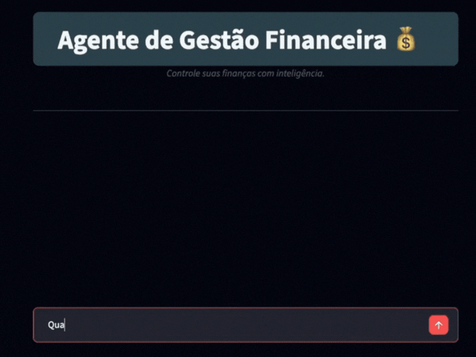
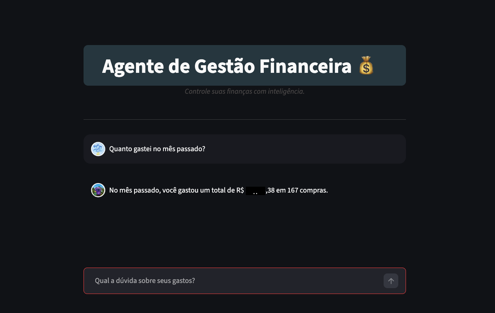
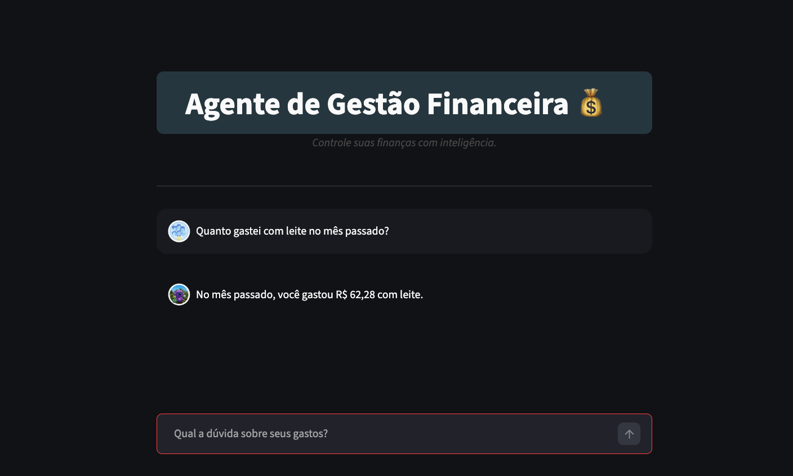

# 💰 Assistente de Finanças


[](https://github.com/LuGodoy/finance-agent-mcp/actions/workflows/ci.yml)

Assistente inteligente de finanças para grupos utilizando **IA generativa**, arquitetura **MCP (Model Context Protocol)**, integração com **Gemini LLM**, banco de dados **MySQL** e interface conversacional construída com **Streamlit**.

## 🎯 Objetivo do Projeto

Projeto desenvolvido como portfólio técnico para demonstrar habilidades em AI Agents, LLM Engineering, Arquitetura Backend, Integração de Dados e Design de Software.


## 💡 Problema que o Projeto Resolve

Grupos que compartilham despesas — como famílias, repúblicas ou times — frequentemente 
perdem o controle dos gastos por falta de uma forma simples de consultar e entender 
os dados financeiros. PPlanilhas são difíceis de navegar e dashboards exigem que o usuário saiba onde clicar.

Este assistente permite que qualquer pessoa do grupo faça perguntas em linguagem natural 
como *"Quanto gastamos em janeiro?"* ou *"De quanto foram os nossos gastos com celular este mês?"* e receba respostas claras e instantâneas — sem precisar abrir uma planilha ou montar um filtro.

---

## ✨ Visão Geral

Este projeto demonstra a construção de um **Agente de IA completo**, capaz de responder perguntas sobre gastos financeiros utilizando dados reais armazenados em banco de dados.

O sistema integra:

- 🤖 Large Language Model (Google Gemini)
- 🧠 Agente inteligente para interpretação das perguntas
- 🔌 MCP Server para acesso estruturado aos dados
- 🗄️ Banco de dados MySQL
- 🎨 Interface conversacional com Streamlit

## 🧠 O que este projeto demonstra

✅ Construção de AI Agent end-to-end  
✅ Integração LLM + Banco de Dados  
✅ Arquitetura MCP com Tool Calling  
✅ Separação clara entre camadas da aplicação  
✅ Organização profissional de projeto Python  
✅ Boas práticas de engenharia de software

---

## 🎬 Demo
<details>
  <summary>Clique para ver a demo</summary>
  
</details>

---

<details>
<summary>📸 Ver mais capturas de tela</summary>

### Chat Interface


### Sumário de Gastos Gerais


### Sumário de Gastos por Item


</details>

---

## 🏗️ Arquitetura do Sistema

<div align="center">
  <a href="architecture.png" target="_blank">
    
  </a>
  <br>
  <p align="center">
    <i>Fluxo de comunicação: Do input do usuário em linguagem natural à execução de Tools SQL via protocolo MCP.</i>
  </p>
</div>

## 📂 Estrutura do Projeto
```
.
├── app
├── assets
├── database
├── docs
├── llm
├── mcp_server
├── shared
└── tests
```

## 🛠️ Funcionalidades do Agente

O servidor MCP expõe ferramentas específicas que permitem ao LLM interagir com o banco de dados de forma segura. Abaixo estão as capacidades implementadas em `mcp_server/tools/`:

| Ferramenta (Tool) | Descrição | Tecnologia |
| :--- | :--- | :--- |
| **Sumário de Despesas** | Consolida gastos por item e/ou pelo período solicitado. | **Python / MCP SDK** |
| **Listagem de Itens** | Recupera detalhes de despesas com busca flexível (`LIKE`). | **SQL (MySQL)** |
| **Camada de Dados** | Interface de conexão e execução de queries parametrizadas. | **MySQL Connector** |
| **Interpretação Natural** | Traduz dados brutos em insights financeiros amigáveis. | **Gemini Prompt Eng.** |

## 🧠 Design Lógico e Fluxo de Pensamento

- **Raciocínio do Agente:** O sistema utiliza uma abordagem de Chain of Thought (Cadeia de Pensamento), onde o agente identifica a intenção do usuário, extrai entidades e decide qual Tool MCP é necessária para buscar os dados.

- **Engenharia de Prompt:** Implementação de técnicas de Few-Shot Prompting e instruções de sistema (System Instructions) para garantir que o LLM mantenha o foco financeiro e formate as respostas com precisão.

- **Protocolo MCP:** A escolha pelo Model Context Protocol garante que a lógica de acesso aos dados (SQL) esteja desacoplada da lógica do modelo, facilitando a troca de provedores de LLM no futuro.

## ⚙️ Stack Tecnológica

### 🤖 IA & LLM
- Google Gemini 1.5 Pro
- MCP (Model Context Protocol)
- Prompt Engineering

### 🎨 Frontend
- Streamlit 1.30+
- Custom CSS

### 🗄️ Backend & Database
- Python 3.13+
- MySQL Connector/Python
- MySQL 8.0

### 🧪 DevOps & Testing
- Pytest
- Python-Dotenv
- Makefile automation

## 🔑 Decisões de Engenharia

- Separação entre **Agent**, **MCP Server** e **Database Layer**
- Uso de Tools MCP para evitar acesso direto do LLM ao banco
- Cache do agente com `st.cache_resource`
- Arquitetura modular preparada para múltiplos modelos LLM
- Organização orientada à escalabilidade e manutenção

---

## 🚀 Como Executar o Projeto

### 1️⃣ Clonar o repositório
```bash
git clone https://github.com/SEU-USUARIO/personal-finance-ai-agent-mcp.git
cd personal-finance-ai-agent-mcp
```

### 2️⃣ Criar ambiente virtual e instalar dependências
```bash
make install
```

Esse comando irá criar o ambiente virtual `.venv` e instalar todas as dependências necessárias.

### 3️⃣ Criar variáveis de ambiente
```bash
make env
```

Edite o arquivo .env gerado e preencha-o com suas credenciais:
```
GEMINI_API_KEY=sua_chave_aqui

DB_HOST=localhost
DB_PORT=3306
DB_USER=root
DB_PASSWORD=sua_senha
DB_NAME=personal_finance
```

### 4️⃣ Executar a aplicação
```bash
make run
```

A aplicação estará disponível em `http://localhost:8501`.

### Executar o MCP Server
```bash
make mcp
```

### Executar testes
```bash
make test
```

---

## 🗺️ Roadmap

Este projeto está em desenvolvimento ativo. Próximas evoluções planejadas:

- [ ] Suporte Multi-LLM, integrando outras APIs (OpenAI GPT-4o, Claude 3.5 Sonnet e Groq) para permitir a escolha do modelo via configuração.
- [ ] Novas MCP Tools para análises mais avançadas
- [ ] Migração das queries SQL puras para **SQLAlchemy** (uso de um ORM como o SQLAlchemy ajudaria na sanitização de queries e na prevenção de SQL Injection,)
- [ ] Suporte a múltiplos grupos de despesas
- [ ] Autenticação de usuários
- [ ] Testes de integração para as MCP Tools
- [ ] Dashboard estatístico com visualização gráfica das despesas 
    (ex: total mensal, categorias mais frequentes, evolução ao longo do tempo)
    - Stack tecnológica planejada: Plotly + Streamlit

---

## 🔧 Troubleshooting

### "Connection refused"

Este erro ocorre quando o serviço MySQL não está em execução. Utilize o comando de acordo com o seu sistema operacional:

** macOS** (via Homebrew)
```bash
brew services start mysql
# ou, para reiniciar:
brew services restart mysql
```

**🐧 Linux**
```bash
sudo systemctl start mysql
# ou, para reiniciar:
sudo systemctl restart mysql
```

**⊞ Windows** (PowerShell como Administrador)
```powershell
net start mysql
```

### "Invalid API Key"

- Verifique se a chave Gemini está correta no `.env`
- Confirme que tem créditos disponíveis na API

---

## 👩‍💻 Autora

**Luciene Godoy**  
Data Science • AI Agents • Software Engineering • Matemática

[](seu-link)
[](https://github.com/LuGodoy)

## 📄 Licença

Este projeto foi desenvolvido para fins educacionais e demonstração de portfólio.

---

<div align="center">

**Desenvolvido com 💙 por Luciene Godoy**

*"Transformando dados em decisões através de conversação inteligente"*

</div>