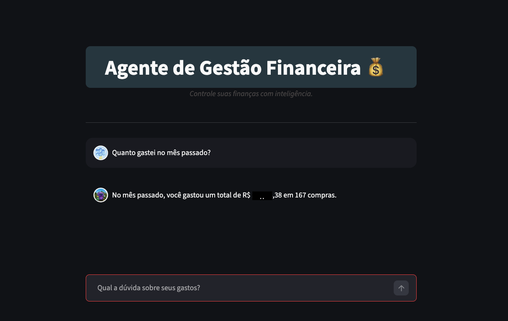

# 💰 Assistente de Finanças


[](https://github.com/LuGodoy/finance-agent-mcp/actions/workflows/ci.yml)

Assistente inteligente de finanças para grupos utilizando **IA generativa**, arquitetura **MCP (Model Context Protocol)**, integração com **Gemini LLM**, banco de dados **MySQL** e interface conversacional construída com **Streamlit**.

## 🎯 Objetivo do Projeto

Projeto desenvolvido como portfólio técnico para demonstrar habilidades em AI Agents, LLM Engineering, Arquitetura Backend, Integração de Dados e Design de Software.


## 💡 Problema que o Projeto Resolve

Grupos que compartilham despesas — como famílias, repúblicas ou times — frequentemente 
perdem o controle dos gastos por falta de uma forma simples de consultar e entender 
os dados financeiros. Planilhas são difíceis de navegar e dashboards exigem que o usuário saiba onde clicar.

Este assistente permite que qualquer pessoa do grupo faça perguntas em linguagem natural 
como *"Quanto gastamos em janeiro?"* ou *"De quanto foram os nossos gastos com leite este mês?"* e receba respostas claras e instantâneas — sem precisar abrir uma planilha ou montar um filtro.

---

## ✨ Visão Geral

Este projeto demonstra a construção de um **Agente de IA completo**, capaz de responder perguntas sobre gastos financeiros utilizando dados reais armazenados em banco de dados.

O sistema integra:

- 🤖 Large Language Model (Google Gemini)
- 🧠 Agente inteligente para interpretação das perguntas
- 🔌 MCP Server para acesso estruturado aos dados
- 🗄️ Banco de dados MySQL local (administrado via MySQL Workbench)
- 🎨 Interface conversacional com Streamlit

## 🧠 O que este projeto demonstra

- Construção de AI Agent end-to-end  
- Integração entre LLM e Banco de Dados via MCP (Model Context Protocol)  
- Arquitetura MCP com Tool Calling  
- Separação clara entre camadas da aplicação  
- Organização profissional de projeto Python  
- Boas práticas de engenharia de software

---

## 🎬 Demo
<details>
  <summary>Clique para ver a demo</summary>
  
</details>

---

<details>
<summary>📸 Ver mais capturas de tela</summary>

### Chat Interface


### Sumário de Gastos Gerais


### Sumário de Gastos por Item


</details>

---

## 🏗️ Arquitetura do Sistema

<div align="center">
  <a href="architecture.png" target="_blank">
    
  </a>
  <br>
  <p align="center">
    <i>Fluxo de comunicação: Do input do usuário em linguagem natural à execução de Tools SQL via protocolo MCP.</i>
  </p>
</div>

## 📂 Estrutura do Projeto
```
.
├── app
├── assets
├── database
├── docs
├── llm
├── mcp_server
├── shared
├── tests
└── utils
```

## 🛠️ Funcionalidades do Agente

O servidor MCP expõe ferramentas específicas que permitem ao LLM interagir com o banco de dados de forma segura. Abaixo estão as capacidades implementadas em `mcp_server/tools/`:

| Ferramenta (Tool) | Descrição | Tecnologia |
| :--- | :--- | :--- |
| **Sumário de Despesas** | Consolida gastos por item e/ou pelo período solicitado. | **Python / MCP SDK** |
| **Listagem de Itens** | Recupera detalhes de despesas com busca flexível (`LIKE`). | **SQL (MySQL)** |
| **Camada de Dados** | Interface de conexão e execução de queries parametrizadas. | **MySQL Connector** |
| **Interpretação Natural** | Traduza dados brutos em informações financeiras amigáveis. | **Gemini Prompt Eng.** |

## 🧠 Design Lógico e Fluxo de Pensamento

- **Raciocínio do Agente:** O sistema utiliza uma abordagem de Chain of Thought (Cadeia de Pensamento), onde o agente identifica a intenção do usuário, extrai entidades e decide qual Tool MCP é necessária para buscar os dados.

- **Engenharia de Prompt:** Implementação de técnicas de Few-Shot Prompting e instruções de sistema (System Instructions) para garantir que o LLM mantenha o foco financeiro e formate as respostas com precisão.

- **Protocolo MCP:** A escolha pelo Model Context Protocol garante que a lógica de acesso aos dados (SQL) esteja desacoplada da lógica do modelo, facilitando a troca de provedores de LLM no futuro.

## ⚙️ Stack Tecnológica

### 🤖 IA & LLM
- Google Gemini 
- MCP (Model Context Protocol)
- Prompt Engineering

### 🎨 Frontend
- Streamlit 1.30+
- Custom CSS

### 🗄️ Backend & Database
- Python 3.13+
- MySQL Connector/Python
- MySQL 8.0

### 🧪 DevOps & Testing
- Pytest
- Python-Dotenv
- Makefile automation

## 🔑 Decisões de Engenharia

- Separação entre **Agent**, **MCP Server** e **Database Layer**
- Uso de Tools MCP para evitar acesso direto do LLM ao banco
- Cache do agente com `st.cache_resource`
- Arquitetura modular preparada para múltiplos modelos LLM
- Organização orientada à escalabilidade e manutenção

---

## 🚀 Como Executar o Projeto

Você pode rodar o projeto de duas formas: com Docker (recomendado) ou com MySQL local.

---

### 🐳 Opção 1 — Com Docker (recomendado)

Pré-requisitos: Docker instalado e uma chave da API do Gemini.
Obtenha sua chave gratuitamente em: https://aistudio.google.com/app/apikey

#### 1️⃣ Clonar o repositório
```bash
git clone https://github.com/LuGodoy/finance-agent-mcp.git
cd finance-agent-mcp
```

#### 2️⃣ Subir o banco de dados
```bash
docker compose up -d
```
Isso cria o banco, a tabela e insere dados de exemplo automaticamente.

#### 3️⃣ Configurar o .env
```bash
make env
```
Abra o `.env` e preencha apenas:

`GEMINI_API_KEY=sua_chave_aqui`

As demais variáveis já estão pré-configuradas. `DB_HOST=localhost` funciona com Docker
porque a porta 3306 é mapeada automaticamente pelo `docker-compose.yml`.

#### 4️⃣ Instalar dependências
```bash
make install
```

#### 5️⃣ Rodar a aplicação
```bash
make run
```
Acesse http://localhost:8501 — o agente já estará funcionando com dados. ✅

---

### 🖥️ Opção 2 — Com MySQL local

#### 1️⃣ Clonar o repositório
```bash
git clone https://github.com/LuGodoy/finance-agent-mcp.git
cd finance-agent-mcp
```

#### 2️⃣ Criar o banco e a tabela
Entre no MySQL e execute:
```sql
CREATE DATABASE personal_finance;
USE personal_finance;

CREATE TABLE transactions (
  id             INT AUTO_INCREMENT PRIMARY KEY,
  nome_item      VARCHAR(255) NOT NULL,
  preco_unitario DECIMAL(10,2) NOT NULL,
  quantidade     DECIMAL(10,3) NOT NULL,
  data_compra    DATE NOT NULL
);
```

#### 3️⃣ Configurar o .env
```bash
make env
```
Edite o `.env` com suas credenciais:

```
GEMINI_API_KEY=sua_chave_aqui
DB_USER=seu_usuario
DB_PASSWORD=sua_senha
```

`DB_HOST=localhost` já é o padrão — não precisa alterar.

#### 4️⃣ Instalar dependências
```bash
make install
```

#### 5️⃣ Rodar a aplicação
```bash
make run
```
A aplicação estará disponível em `http://localhost:8501`/. ✅

---

### 🔌 Executar o MCP Server (opcional)
```bash
make mcp
```
O MCP Server é o componente que expõe as ferramentas financeiras para o LLM.
Em uso normal ele é iniciado automaticamente pelo agente — você só precisa
rodá-lo standalone para depuração ou desenvolvimento de novas tools.

---

### Executar testes

O projeto tem dois tipos de testes:

| Tipo | Arquivo | Precisa do banco? |
|------|---------|-------------------|
| Infraestrutura | `tests/test_infra.py` | ✅ Sim |
| Agente (mock) | `tests/test_gemini_client.py` | ❌ Não |

**Com Docker ativo** (recomendado para rodar todos os testes):
```bash
docker compose up -d
make test
```

### Executar testes (recomendado)
```bash
make test
```
Os testes de infraestrutura serão pulados automaticamente se o banco
não estiver disponível.

---

## 🗺️ Roadmap

Este projeto está em desenvolvimento ativo. Próximas evoluções planejadas:

- [ ] Suporte Multi-LLM, integrando outras APIs (OpenAI GPT-4o, Claude 3.5 Sonnet e Groq) para permitir a escolha do modelo via configuração.
- [ ] Novas MCP Tools para análises mais avançadas
- [ ] Migração das queries SQL puras para **SQLAlchemy** (uso de um ORM como o SQLAlchemy ajudaria na sanitização de queries e na prevenção de SQL Injection)
- [ ] Suporte a múltiplos grupos de despesas
- [ ] Autenticação de usuários
- [ ] Testes de integração para as MCP Tools
- [ ] Dashboard estatístico com visualização gráfica das despesas 
    (ex: total mensal, categorias mais frequentes, evolução ao longo do tempo)
    - Stack tecnológica planejada: Plotly + Streamlit

---

## 🔧 Troubleshooting

### "Connection refused"

Este erro ocorre quando o serviço MySQL não está em execução. Utilize o comando de acordo com o seu sistema operacional:

** macOS** (via Homebrew)
```bash
brew services start mysql
# ou, para reiniciar:
brew services restart mysql
```

**🐧 Linux**
```bash
sudo systemctl start mysql
# ou, para reiniciar:
sudo systemctl restart mysql
```

**⊞ Windows** (PowerShell como Administrador)
```powershell
net start mysql
```

### "Invalid API Key"

- Verifique se a chave Gemini está correta no `.env`
- Confirme que tem créditos disponíveis na API

---

## 👩‍💻 Autora

**Luciene Godoy**  
AI Agents | Data Science | Software Engineering | Matemática

**Stack:** Python • MCP • Google Gemini • MySQL • Streamlit

<p align="center">

[](https://www.linkedin.com/in/luciene-godoy-b8670a179)
[](https://github.com/LuGodoy)

</p>

## 📄 Licença

Este projeto foi desenvolvido para fins educacionais e demonstração de portfólio.

---

<div align="center">

**Desenvolvido com 💙 por Luciene Godoy**

*"Transformando dados em decisões através de conversação inteligente"*

</div>